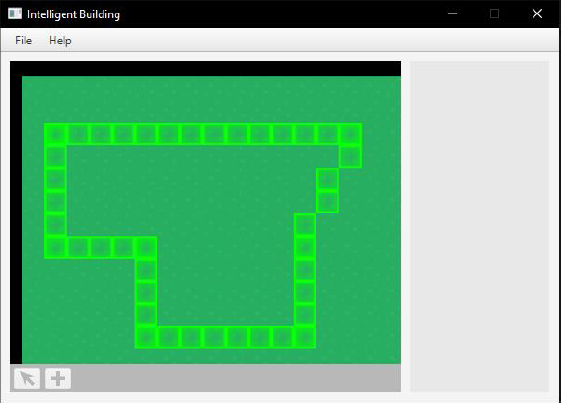
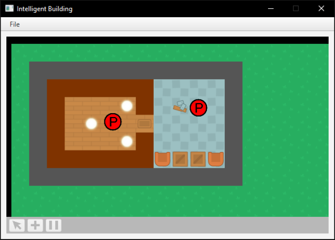

# intelligent-building
A program to simulate a basic building. Includes event-driven entities and tools. Spiritual successor to [this project](https://github.com/callumvanzyl/Forge). Created by Callum Van Zyl for Java coursework @ University of Reading.

People entities will randomly explore the building and rooms that you have created.

Some entities respond to events, such as a light turning on only when there is at least one person in the room.
